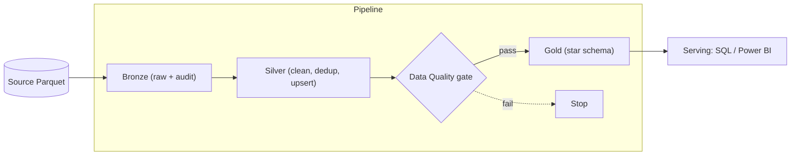
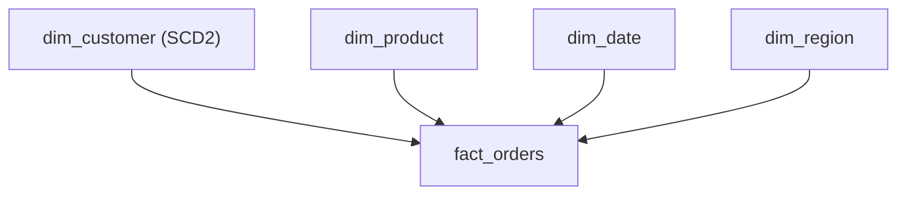

# Architecture

## Overview

A batch data pipeline implementing the **medallion architecture** on Databricks +
Unity Catalog. Raw retail data flows through Bronze → Silver → Gold, gated by a
data quality step, and is orchestrated as a Databricks Job.

## Data flow



## Orchestration (Job DAG)

```
bronze  →  silver  →  data_quality  →  gold
```

Each task depends on the previous. A hard data-quality failure blocks Gold.

## Layer responsibilities

| Layer | Responsibility | Key techniques |
|-------|----------------|----------------|
| Bronze | Faithful raw copy | Audit columns, append, idempotent incremental via control table |
| Silver | Trustworthy clean state | Type casting, filtering, dedup (ROW_NUMBER), incremental MERGE upsert |
| Data Quality | Trust gate | Tiered checks (hard-fail vs warn) |
| Gold | Business-ready model | Star schema, surrogate keys, SCD Type 2 |

## Data model (star schema)



- **fact_orders** — grain: one row per order; measures: quantity, total_amount; FKs: customer_key, product_key, date_key
- **dim_customer** — SCD Type 2 (effective_from / effective_to / is_current), surrogate key per version
- **dim_product / dim_region / dim_date** — conformed dimensions with surrogate keys

## Key design decisions

- **Idempotency** via a control (watermark) table so retries never duplicate data.
- **Latest-wins dedup** ordered by batch then ingest time (deterministic tie-break).
- **Surrogate keys** decouple the warehouse from source keys and enable SCD2 (one
  customer can have multiple versioned rows, each with a unique key).
- **Fact loads via surrogate-key lookup** joining natural keys to dimensions.

## Known limitations

See the "Known limitations & future work" section in the main README.
